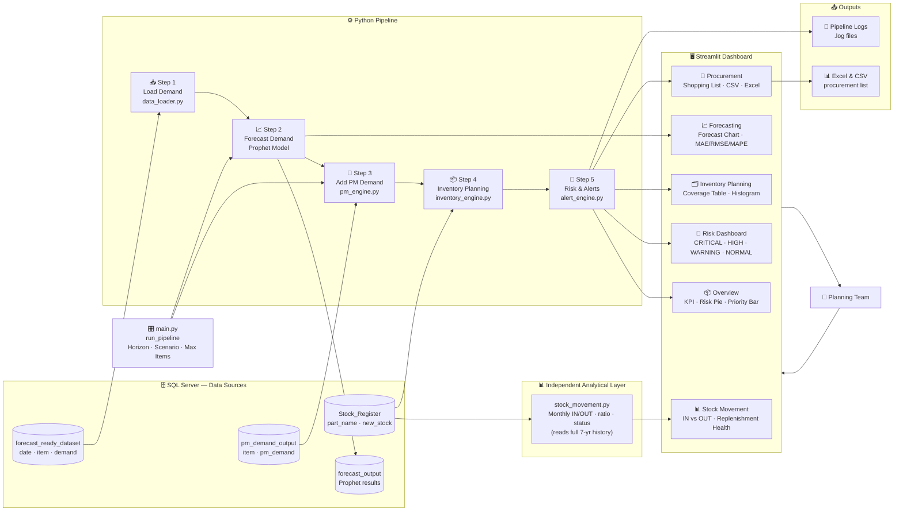

# 📦 PE Inventory Forecasting & Planning System

> **Predictive analytics for spare-part demand, stock planning, and procurement — built for PE's DG generator service operations.**

[](https://python.org)
[](https://streamlit.io)
[](https://facebook.github.io/prophet/)
[](https://www.microsoft.com/sql-server)
[](LICENSE)

🔗 **GitHub Repository**: [https://github.com/icodervivek/inventory-forecasting-scenario](https://github.com/icodervivek/inventory-forecasting-scenario)

---

## 📌 Table of Contents

- [Problem Statement](#-problem-statement)
- [What the System Does](#-what-the-system-does)
- [Features](#-features)
- [Tech Stack](#-tech-stack)
- [High Level Design (HLD)](#-high-level-design-hld)
- [Project Structure](#-project-structure)
- [Database Tables](#-database-tables)
- [Environment Variables](#-environment-variables)
- [Steps to Run Locally](#-steps-to-run-locally)
- [Dashboard Pages](#-dashboard-pages)
- [Forecast Accuracy Metrics](#-forecast-accuracy-metrics)
- [Scenario Analysis](#-scenario-analysis)
- [Stock Movement Analysis](#-stock-movement-analysis)

---

## 🎯 Problem Statement

**PE** manages DG (diesel generator) maintenance for telecom tower sites and needs spare parts readily available to keep operations running. The company has:

- Historical stock movement data (what was used, when, and how much)
- Visibility into preventive maintenance (PM) schedules (what parts will be needed and when)

The challenge is to build a **forecasting solution** that estimates future stock requirements using:

- historical stock movement
- stock-in and stock-out patterns
- preventive maintenance pipeline
- planned maintenance requirements

The goal is to help PE **reduce shortages, avoid overstocking, and improve procurement planning**.

---

## ✅ What the System Does

```
Historical Demand  →  Prophet Forecast  →  + PM Demand  →  Inventory Plan  →  Risk Labels  →  Dashboard & Exports
```

In plain terms:
1. Learns past demand patterns per spare part using Facebook Prophet
2. Forecasts demand for the next 30, 60, or 90 days
3. Adds planned maintenance demand on top
4. Compares total expected demand against current stock
5. Flags items at risk (CRITICAL / HIGH / WARNING / NORMAL)
6. Recommends exactly how much to reorder — and in what priority
7. Surfaces everything through an interactive Streamlit dashboard with export options
8. Independently analyses 7 years of stock-in / stock-out history to reveal replenishment health per item

---

## 🚀 Features

| # | Feature | Description |
|---|---|---|
| 1 | **SQL Server Connection** | SQLAlchemy + environment variables for secure DB connectivity |
| 2 | **Historical Demand Loader** | Loads & caches `forecast_ready_dataset` with day/week/month aggregation |
| 3 | **Prophet Forecast Engine** | Per-item models with yearly & weekly seasonality, 30/60/90-day horizons |
| 4 | **PM Demand Integration** | Combines organic forecast with planned maintenance demand |
| 5 | **Inventory Planning Engine** | Computes stock coverage, shortfall, safety stock, and reorder quantities |
| 6 | **Stock Coverage Calculation** | "How many days will current stock last at this usage rate?" |
| 7 | **Risk Engine** | Classifies every item: 🔴 CRITICAL / 🟠 HIGH / 🟡 WARNING / 🟢 NORMAL |
| 8 | **Procurement Priority Engine** | Labels items HIGH / MEDIUM / LOW for buying urgency |
| 9 | **Streamlit Dashboard** | 6-page interactive web app with charts, tables, and downloads |
| 10 | **Scenario Analysis** | Simulate Normal / +20% Demand / +50% PM Activity before committing |
| 11 | **Export** | Downloadable procurement list in CSV and Excel (.xlsx) formats |
| 12 | **Logging** | Daily rotating pipeline logs — items processed, errors, execution time |
| 13 | **Stock Movement Analysis** | Monthly IN vs OUT patterns, replenishment ratio, and health labels across all 1,625 items from 7 years of history |

---

## 🛠 Tech Stack

| Layer | Technology |
|---|---|
| **Language** | Python 3.12 |
| **Forecasting** | Facebook Prophet |
| **Data Wrangling** | pandas, numpy |
| **Database** | Microsoft SQL Server |
| **DB Connection** | SQLAlchemy, pyodbc, python-dotenv |
| **Dashboard** | Streamlit |
| **Charts** | Plotly Express + Plotly Graph Objects |
| **Excel Export** | openpyxl |
| **Presentation** | python-pptx |
| **Logging** | Python built-in logging module |

---

## 🗺 High Level Design (HLD)



---

## 📁 Project Structure

```
inventory-forecasting/
│
├── .env                        # Environment variables (DB credentials)
├── main.py                     # Pipeline orchestrator — run_pipeline()
├── requirements.txt            # Python dependencies
│
├── config/
│   ├── database.py             # SQLAlchemy engine setup
│   └── logger.py               # Logging configuration
│
├── services/
│   ├── data_loader.py          # Feature 1 — Historical demand loader
│   ├── forecasting.py          # Feature 2 — Prophet forecast engine
│   ├── pm_engine.py            # Feature 3 — PM demand integration
│   ├── inventory_engine.py     # Feature 4 — Inventory planning engine
│   ├── alert_engine.py         # Feature 5 — Risk & procurement alert engine
│   └── stock_movement.py       # Feature 13 — Stock Movement Analysis (independent layer)
│
├── dashboard/
│   └── app.py                  # Streamlit 6-page dashboard
│
├── models/
│   └── __init__.py
│
├── outputs/
│   ├── procurement_list.xlsx   # Latest exported procurement list
│   └── generate_presentation.py
│
└── logs/
    └── pipeline_YYYY-MM-DD.log # Daily rotating pipeline logs
```

---

## 🗄️ Database Tables

| Table | Purpose | Key Columns |
|---|---|---|
| `forecast_ready_dataset` | Historical demand input for Prophet | `date`, `item`, `demand` |
| `pm_demand_output` | Planned / preventive maintenance demand | `item`, `pm_demand` |
| `Stock_Register` | Inventory movement & stock tracking | `part_name`, `qty`, `in_out`, `new_stock`, `ts` — used two ways: latest snapshot for planning (Step 4), full 7-year history for Stock Movement analysis |
| `forecast_output` | Prophet forecast results (written by pipeline) | `item`, `forecast_date`, `predicted_demand` |

---

## 🔐 Environment Variables

Create a `.env` file in the root of the project with the following variables:

```env
# SQL Server connection details
DB_SERVER=your_server.database.windows.net
DB_DATABASE=your_database_name
DB_USERNAME=your_username
DB_PASSWORD=your_password
DB_DRIVER=ODBC Driver 17 for SQL Server
```

> ⚠️ **Never commit your `.env` file to version control.** Add it to `.gitignore`.

| Variable | Description | Example |
|---|---|---|
| `DB_SERVER` | SQL Server hostname or Azure SQL endpoint | `myserver.database.windows.net` |
| `DB_DATABASE` | Name of the database | `inventory_db` |
| `DB_USERNAME` | SQL login username | `sqladmin` |
| `DB_PASSWORD` | SQL login password | `YourPassword@123` |
| `DB_DRIVER` | ODBC driver name (must be installed) | `ODBC Driver 17 for SQL Server` |

---

## 🖥️ Steps to Run Locally

### Prerequisites
- Python 3.12+
- Microsoft ODBC Driver 17 for SQL Server ([Download here](https://learn.microsoft.com/en-us/sql/connect/odbc/download-odbc-driver-for-sql-server))
- Access to a SQL Server instance with the required tables populated

---

### Step 1 — Clone the repository

```bash
git clone https://github.com/icodervivek/inventory-forecasting-scenario.git
cd inventory-forecasting-scenario
```

### Step 2 — Create a virtual environment

```bash
# Windows
python -m venv venv
venv\Scripts\activate

# Mac / Linux
python -m venv venv
source venv/bin/activate
```

### Step 3 — Install dependencies

```bash
pip install -r requirements.txt
```

### Step 4 — Set up environment variables

Create a `.env` file in the root folder:

```bash
# Windows
copy .env.example .env

# Or create manually and fill in your credentials
```

Edit `.env` with your actual SQL Server details:

```env
DB_SERVER=your_server.database.windows.net
DB_DATABASE=your_database_name
DB_USERNAME=your_username
DB_PASSWORD=your_password
DB_DRIVER=ODBC Driver 17 for SQL Server
```

### Step 5 — Test the database connection

```bash
python config/database.py
```

Expected output:
```
Connection successful: (1,)
```

### Step 6 — Run the pipeline (optional, CLI test)

```bash
python main.py
```

This runs the full pipeline for 5 items and prints a quick result summary to the console.

### Step 7 — Launch the Streamlit dashboard

```bash
streamlit run dashboard/app.py
```

The dashboard will open in your browser at:
```
http://localhost:8501
```

---

## 📊 Dashboard Pages

| Page | What it shows |
|---|---|
| **📦 Overview** | KPI cards (total parts, critical items, total demand), risk distribution pie chart, procurement priority bar chart, full summary table |
| **📈 Forecasting** | Pick any item → historical demand line chart + forecast with confidence band + MAE/RMSE/MAPE accuracy metrics |
| **🗂️ Inventory Planning** | Full planning table sorted by urgency (stock coverage days) + coverage distribution histogram |
| **🚨 Risk Dashboard** | Items grouped into expandable CRITICAL / HIGH / WARNING / NORMAL sections |
| **🛒 Procurement** | Prioritized shopping list grouped by HIGH/MEDIUM/LOW, with CSV and Excel download buttons |
| **📊 Stock Movement** | Monthly IN vs OUT grouped bar chart · net movement line chart · top 15 consuming items · replenishment health pie + filterable summary table for all 1,625 items |

### Sidebar Controls

| Control | Affects |
|---|---|
| **Forecast Horizon** (30/60/90 days) | Overview, Inventory Planning, Risk, Procurement only |
| **Scenario** | Overview, Inventory Planning, Risk, Procurement only |
| **Max Items** | Overview, Inventory Planning, Risk, Procurement only |
| **Run Pipeline** button | Overview, Inventory Planning, Risk, Procurement only |

> 💡 The **Forecasting page** is independent — it has its own "Generate Forecast" button and only listens to the Horizon setting.

> 📊 The **Stock Movement page** is fully independent — it loads directly from `Stock_Register` on page visit. It is not triggered by Run Pipeline and is not affected by Horizon, Scenario, or Max Items.

---

## 📐 Forecast Accuracy Metrics

The app measures how well the Prophet model would have predicted demand, by training on the oldest 80% of each item's history and testing against the remaining 20%:

| Metric | What it measures | Unit |
|---|---|---|
| **MAE** | Average size of the miss | Same units as demand (parts) |
| **RMSE** | Like MAE but penalises large misses harder | Same units as demand (parts) |
| **MAPE** | Average miss as a percentage of actual demand | % |

> Items with fewer than **15 rows** of history will show **N/A** for all three metrics — not enough data to split and meaningfully evaluate.

---

## 🔀 Scenario Analysis

Simulate different future conditions before committing to a purchase plan:

| Scenario | Demand Multiplier | PM Multiplier | Use Case |
|---|---|---|---|
| **Normal** | × 1.0 | × 1.0 | Baseline — current expected conditions |
| **+20% Demand** | × 1.2 | × 1.0 | What if organic usage spikes by 20%? |
| **+50% PM Activity** | × 1.0 | × 1.5 | What if maintenance workload grows by 50%? |

Multipliers are applied to `predicted_demand` and `pm_demand` **after** Prophet trains — so the model always learns from real historical patterns, and the scenario simply adjusts the output for what-if planning.

---

## 📊 Stock Movement Analysis

An **independent analytical layer** (`services/stock_movement.py`) that reads the **full 7-year history** of `Stock_Register` — 115,628 transactions, spanning 2018–2026, across 1,625 unique items — to reveal how stock has actually flowed in and out over time. This is separate from the forward-looking forecast pipeline:

> Steps 1–6 answer **"What will we need in the future?"**  ·  Stock Movement answers **"How has stock actually flowed historically?"**

### Columns & Formulas

| Column | Formula | Meaning |
|---|---|---|
| `total_in` | `SUM(qty)` where `in_out = 'IN'`, per item per month | Total quantity received that month |
| `total_out` | `SUM(qty)` where `in_out = 'OUT'`, per item per month | Total quantity consumed/issued that month |
| `net_movement` | `total_in − total_out` | Positive = surplus that month, Negative = deficit |
| `replenishment_ratio` | `total_in ÷ total_out` (`None` if `total_out = 0`) | How much of consumption was restocked |
| `active_months` | `COUNT(DISTINCT FORMAT(ts, 'yyyy-MM'))` | Number of months with any transaction activity |
| `avg_monthly_in` | `total_in (all-time) ÷ active_months` | Average monthly quantity received |
| `avg_monthly_out` | `total_out (all-time) ÷ active_months` | Average monthly quantity consumed |
| `avg_net_movement` | `avg_monthly_in − avg_monthly_out` | Average monthly surplus/deficit |
| `consumption_status` | see thresholds below | Replenishment health label |

### Replenishment Health Thresholds (`consumption_status`)

| `replenishment_ratio` | Status | Meaning |
|---|---|---|
| ≥ 1.2 | **OVERSTOCKED** | Receiving notably more than is being consumed |
| 0.9 – 1.19 | **BALANCED** | Inflow roughly matches outflow |
| 0.6 – 0.89 | **UNDER-REPLENISHED** | Restocking is lagging behind consumption |
| < 0.6 | **CRITICALLY LOW REPLENISHMENT** | Consumption far exceeds restocking — high shortage risk |
| N/A (`total_out = 0`) | **NO CONSUMPTION** | Item has never been issued out |

### Key Functions (`services/stock_movement.py`)

| Function | Returns |
|---|---|
| `get_overall_stats()` | High-level KPIs — total IN/OUT transaction counts & quantities, date range, unique items |
| `load_monthly_movement(item=None)` | Per-item monthly IN vs OUT trend with `net_movement` and `replenishment_ratio` |
| `get_top_consuming_items(top_n=20)` | Top N items ranked by total OUT quantity (all-time) |
| `load_movement_summary()` | One row per item — averages, ratio, and `consumption_status` for all 1,625 items |

> 📌 This layer is fully independent of the main pipeline — it does **not** require **Run Pipeline**, and is unaffected by **Horizon**, **Scenario**, or **Max Items**.

---

## 📄 License

This project is licensed under the MIT License.

---

> Built with ❤️ for PE's inventory planning team · Powered by Python, Prophet & Streamlit
